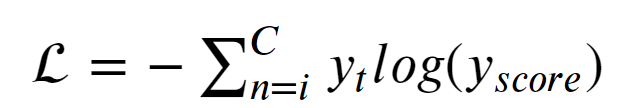
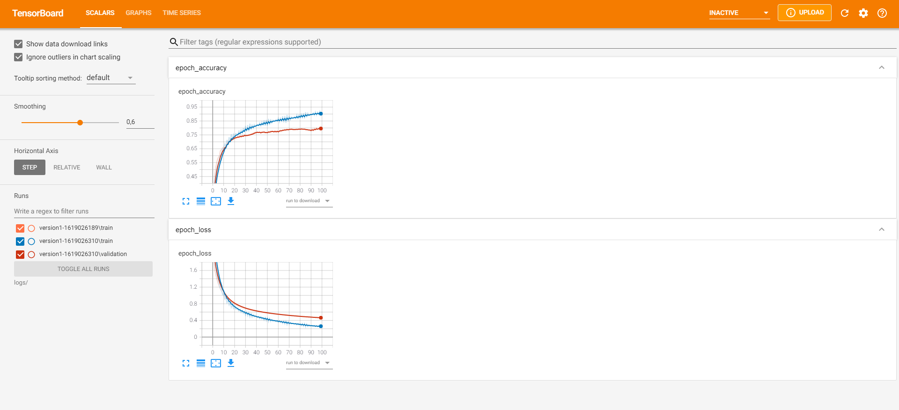

# F1 2019 with Deep Learning :car: :computer:

## Project Description
F1 2019 official game car control with the implementation of Deep Learning algorithms. Data generation with lane line detection, with game capture and image processing using ```PIL``` and ```OpenCV```. 
<br>
<br> Acess to keys data was obtained with [pydirectinput](https://github.com/learncodebygaming/pydirectinput) library. Check the [repository](https://github.com/learncodebygaming/pydirectinput) and [LearnCodeByGaming](https://github.com/learncodebygaming) awesome content (also on [Youtube](https://www.youtube.com/channel/UCD8vb6Bi7_K_78nItq5YITA) and official [website](https://learncodebygaming.com/)).

<p align="center">
  
</p>

<br> Inference code includes GPU support. An NVIDIA GeForce GTX 1060 6GB was used for this project.

## Pipeline

- Acess to game capture with [OpenCV](https://docs.opencv.org/master/d6/d00/tutorial_py_root.html);
- Road Lane Line Detection with [Hough Line Transform](https://opencv24-python-tutorials.readthedocs.io/en/stable/py_tutorials/py_imgproc/py_houghlines/py_houghlines.html);
- Collection of video frames data with encoded pressed and released keys;
- Custom CNN and Mobile Net implementation.

To collect data from the game (keys and frames), use the  ```model_input.py``` script. Individual game frames with track delimiter can be acquired with the ```data_collection.py``` script.

## Dependencies

Check the ```requirements.txt ``` to see the project dependencies. These include ```tensorflow --version 2.4``` and ```CUDA 11```.


## Instructions

```
sudo pip install -r requirements.txt
git clone https://github.com/taamfp/F12019DL.git
cd F12019DL
python3 input.py (above 5000 frames)
python3 custom_cnn.py (F1_model.h5)
python3 main.py
```

## Models

Both custom CNN and Mobile Net ([paper](https://arxiv.org/abs/1704.04861)) models were implemented for the project.

### Custom CNN

The custom CNN is given with an input size of ```350x350```, following a Conv2D layer section. A Flatten layer compresses all the information to a 1D array for a fully connected 
layer section. The rectifier activation function was used in all layers except the output layer.


            
<br>The output layer consists of 9 nodes, one for each possible keyboard movement. In this case the softmax activation function was used.

<br>Categorical Cross Entropy function is used in this situation for multi-label task, which can be defined as the following: 




## Tensorboard visualization

To check the inference metrics, use ```tensorboard --logdir logs/```.

<p>
  
</p>


## Further work

- Performance optimization;
- Hyperparameter Tuning;
- Online Inference;
- Implementation of other algorithms.

Feel free to add any sugestions or to contribute to the project :thumbsup: .
